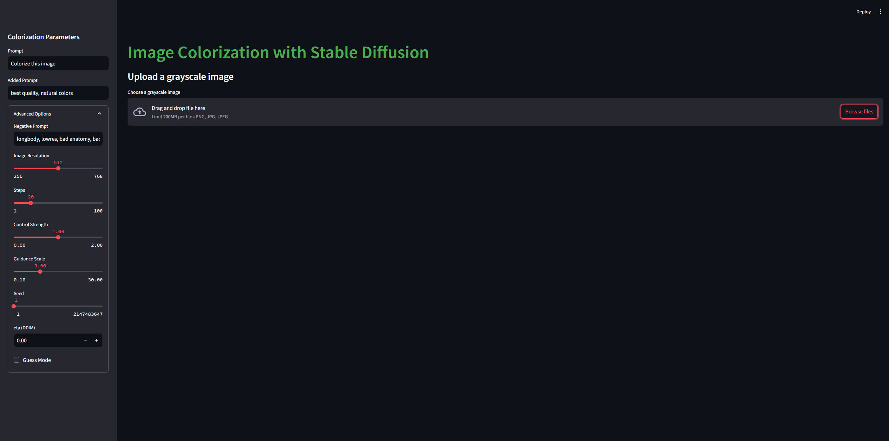

<<<<<<< HEAD
# Colorization-for-grayscale-images

This project provides a web-based application for colorizing grayscale images using the ControlNet architecture and Stable Diffusion. The application consists of a backend API built with FastAPI and a frontend interface built with Streamlit. The backend handles the image processing and colorization, while the frontend provides a user-friendly interface for uploading images and adjusting colorization parameters.

## UI Screenshot


## Features
- **Grayscale Image Colorization**: Convert black-and-white images to color using ControlNet and Stable Diffusion.
- **Customizable Parameters**: Adjust various settings such as image resolution, control strength, guidance scale, and more.
- **User-Friendly Interface**: A Streamlit-based frontend for easy image uploads and downloads.
- **API Integration**: The backend API can be used independently for integration with other applications.

## Project Structure
The project is divided into two main components:

- **Backend** (`backend/src/main.py`): FastAPI server for image processing and colorization using ControlNet.
- **Frontend** (`frontend/app.py`): Streamlit application providing the user interface.

## Setup Instructions

### Prerequisites
- Python 3.8 or higher
- CUDA-enabled GPU (recommended for faster processing)

### Installation
1. Clone the repository:
    ```bash
    git clone https://github.com/Trongtinne/ControlNET.git
    cd colorization-project
    ```
2. Create a virtual environment (optional but recommended):
    ```bash
    python -m venv venv
    source venv/bin/activate  # On Windows, use `venv\Scripts\activate`
    ```
3. Install dependencies:
    ```bash
    pip install -r requirements.txt
    ```
4. Download the pre-trained ControlNet model weights:
    - Download intructions from the ControlNet repository.
    - Place the checkpoint file in `backend/src/checkpoints/`.

## Running the Application

### Start the Backend Server
```bash
python backend/src/main.py
```
The backend server will start on `http://localhost:8000`.

### Start the Frontend Application
```bash
streamlit run frontend/app.py
```
The Streamlit app will be available at `http://localhost:8501`.

## Usage
1. **Upload a Grayscale Image**: Use the file uploader in the Streamlit app.
2. **Adjust Parameters**: Modify settings like prompt, resolution, control strength, and guidance scale.
3. **Colorize the Image**: Click the "Colorize Image" button.
4. **Download the Colorized Image**: Save the processed image.

## API Documentation
### `POST /api/colorize`

#### Response:
Returns the colorized image in PNG format.


## Acknowledgments
- This project uses the ControlNet architecture from [lllyasviel/ControlNet](https://github.com/lllyasviel/ControlNet).


## Contributing
Contributions are welcome! Please open an issue or submit a pull request.

## License
This project is licensed under the MIT License. See the LICENSE file for details.
=======
# ControlNET
>>>>>>> 37e6941558deb96b5be9b9a8e9e35fe4463a79df
